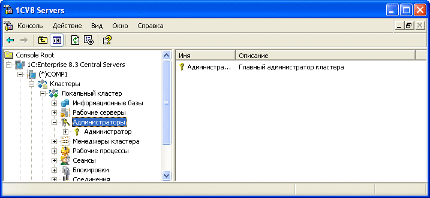
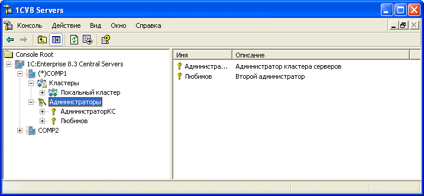

## Содержание
 - [Alkir-web-rac](#alkir-web-rac)
 - [Как использовать](#как-использовать)
 - [Получение данных](#получение-данных)
 - [Параметры запроса](#параметры-запроса)
 - [Вариант CURL](#вариант-curl)
 - [Вариант REST Client для VS Code](#вариант-rest-client-для-vs-code)
 - [Документация](#документация)
 - [Зачем "еще один велосипед"](#зачем-еще-один-велосипед)
 - [О Компании Digilabs](#о-компании-digilabs)
 - [Известные проблемы](#известные-проблемы)
 - [Благодарности](#благодарности)


# **Alkir-web-rac**
Alkir-web-rac реализует http api к 1С RAS (Remote Administration Server) и базируется на java-библиотеках выпущенных самой компанией 1С. **Это не обертка над консольным RAC!**  
Приложение полностью stateless.  
Фичи:
 - Поддержка всех команд RAC (получение данных, создание и модификация объектов)
 - Отдача метрик в формате Prometheus (сессии, рабочие процессы)
 - Держит нагрузку - 3-5 запросов в секунду - полет нормальный в течении многих недель

# Как использовать
Запуск крайне прост
```
docker run dockerhub.alkir.ru/alkir-web-rac -d -p 8000:8000 -m 500m --name=alkir-web-rac --restart=always alkir-web-rac
```
где:
 - -d - запуск в фоновом режиме (отдает управление обратно в консоль)
 - -p - проброс внешних портов внутрь контейнера, чтобы можно было достучаться до приложения внутри. первое значение - порт хоста, второе значение - порт внутри контейнера
 - -m - очень важный параметр. в связи с тем, что это Java и в java машине утечка памяти совершенно нормальное дело, то без ограничения памяти этот контейнер сожрет всю память в вашей операциоке
 - --restart=always - Всегда перезапускать контейнер, если он остановился. Если он остановлен вручную, то контейнер перезапустится только при перезапуске демона Docker или при перезапуске самого контейнера вручную.
 - --name= - задание имени контейнера

## Получение данных
### Параметры запроса
1. Должен быть добавлен header 'content-type: application/json; charset=utf-8'
2. Базовые параметры запроса:
   - ras_server - адрес ras-сервера (обязательный параметр)
   - ras_port - порт ras-сервера (по умолчанию 1543, задавать не обязательно)
   - cluster_admin - имя администратора кластера (по умолчанию пустой, задавать не обязательно)
   - cluster_pwd - пароль администратора кластера (по умолчанию пустой, задавать не обязательно)  
     
   - central_admin - имя администратора центрального сервера (по умолчанию пустой, задавать не обязательно) (https://its.1c.ru/db/v8327doc#bookmark:cs:TI000000147)
   - central_pwd - пароль администратора центрального сервера (по умолчанию пустой, задавать не обязательно)  
     
   - cluster_name - имя кластера (задавать не обязательно если кластер один на сервере, получается автоматически)
   - cluster_id - id кластера  (задавать не обязательно если кластер один на сервере, получается автоматически)

### Вариант CURL:

```
curl --request POST \
  --url http://localhost:8000/v1/session/list/cluster/ \
  --header 'content-type: application/json; charset=utf-8' \
  --header 'user-agent: vscode-restclient' \
  --data '{"ras_server": "192.168.217.4","ras_port": 1645,"cluster_admin": "test_add1","cluster_pwd": "123","with_license": true}'
```

### Вариант [REST Client](https://marketplace.visualstudio.com/items?itemName=humao.rest-client) для VS Code:

```
POST http://localhost:8000/cluster/list/ HTTP/1.1
content-type: application/json; charset=utf-8

{
  "ras_server": "192.168.1.1",
  "ras_port": 1645
}
```


# Документация
Одним из важнейших пунктов в моем понимании - это документация. Она встроена в само API и находится по адресу http://localhost:8000/v1/docs

# Зачем "еще один велосипед"
Ответ банальный и простой - не нашел того, чтобы удовлетворяло мои потребности. Есть куча оберток надо консольной утилитой rac, но в связи с тем что версий 1С у меня много - этот вариант для меня не вариант.

# О Компании Digilabs
 - Мы занимаемся производительностью 1С
 - Мы сделали отличный инструмент для решения проблем с производительностью Алькир
 - Часть наших тулов (как web-rac) мы будем выкладывать в open-source


# Известные проблемы
Так как низами лежит java библиотека, есть проблемы с OutOfMemory на уровне библиотеки и Java. Поэтому в решении сделал костыль в виде самоперезапуска в случае получения OOM от Java

# Благодарности
 - Отдельная и большая благодарность Никите Федькину ([@nixel2007_thoughts](https://t.me/nixel2007_thoughts) - подписывайтесь на канал Никиты, лайкайте, донатье) за помощь в создании этого решения. Если бы не он - я бы не осилил это все собрать
 - Отзывчивым людям из чатика 1С, БСП, DevOps и Архитектура ([@ssl1c](https://t.me/ssl1c)) за ответы на мои глупые вопросы про 1С